# daily client

One of 3 projects (client, staff, company)

## Style Guides

Every major project has its own style guide: a set of conventions (sometimes arbitrary) about how to write code for that project. It is much easier to understand a large codebase when all the code in it is in a consistent style.

“Style” covers a lot of ground, from “use camelCase for variable names” to “never use global variables” to “never use exceptions.” This project links to the style guidelines we use for `Daily Box` code. If you are modifying a project that originated at `Daily Box`, you may be pointed to this page to see the style guides that apply to that project.

The following `Daily Box` style guides live outside of this project: Go Code Review Comments and Effective Dart.

# Guides To Files And Folders `Project Structure`

## New Project

if u need to create new `Daily` project.

1. add [chaotic_helper](https://pub.dev/packages/chaotic_helper) package in dev_dependencies section
2. create bin/main.dart file
3. 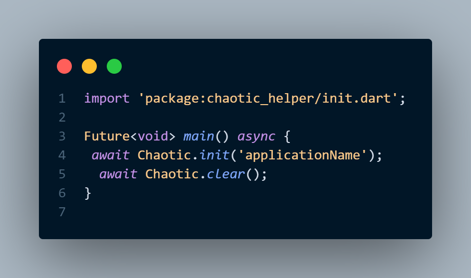
4. run and wait until finish

## Screens

1. 
2. in `src/screen/[name]` it will create two file with it's own templates

- name.dart
- name_provider.dart

### Note : >

1. in code you will write screen name using snake case ex. if you need to create screen that called ContractedCompany then use `await Chaotic.newScreen(contracted_company);`
2. don't worry your classes name will be in CamelCase `ContractedCompanyScreen` and `ContractedCompanyProvider`
3. remember this roles when you naming any thing created by 'chaotic package'
4. in any root folder in src folder you will find files like `screens.dart`, `commons.dart`, `services.dart`, `widgets.dart` and `models.dart`
   this files exists make imports much easy
   so if you need to show all screens just import `screens.dart` file
5. in src folder there is `application.dart` file if you import this file you will show all `screens, common, widgets, services and models` that you created before also you can access all feature from `chaotic package`
   so just import application.dart file 😍 and you will see everything from everywhere

## Commons

> it's files that represent some values or helper functions like `color`, `endpoint` or `helper` > 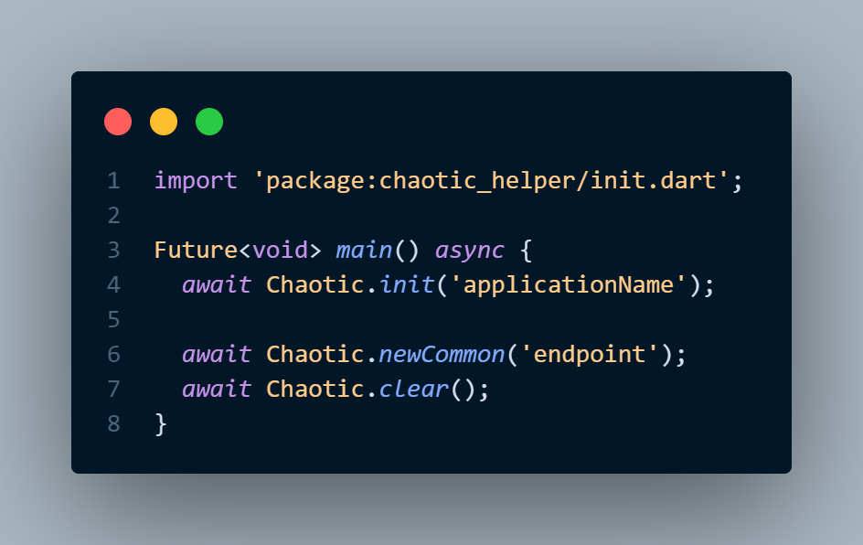

## Services

> all service classes writhen by singleton design pattern "that always return same instance".
> 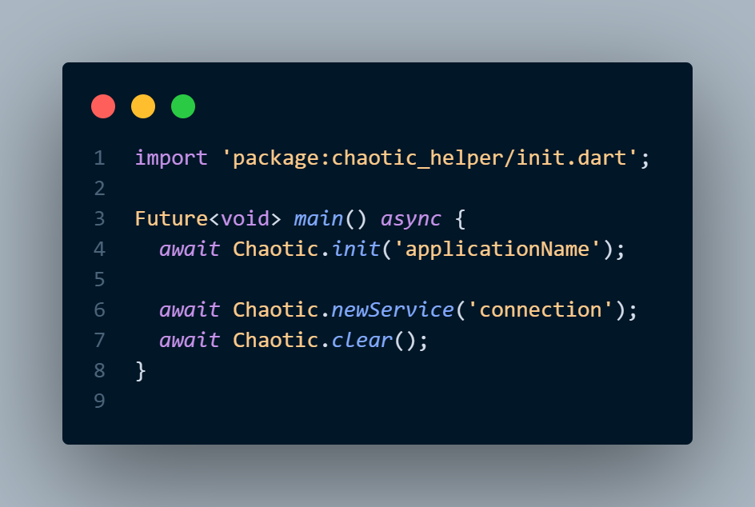

## Assets

1. create new asset folder using package
2. create new asset folder for new screen that have images `separated folders`

## Widgets

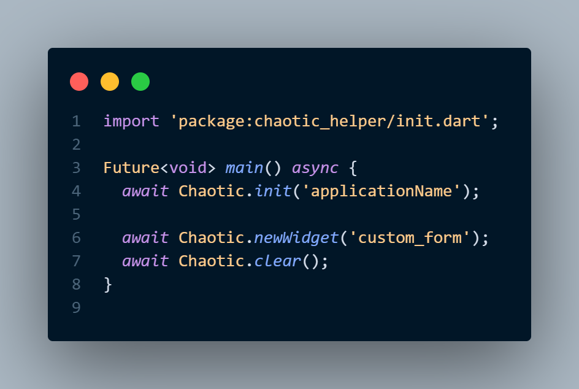

## Models

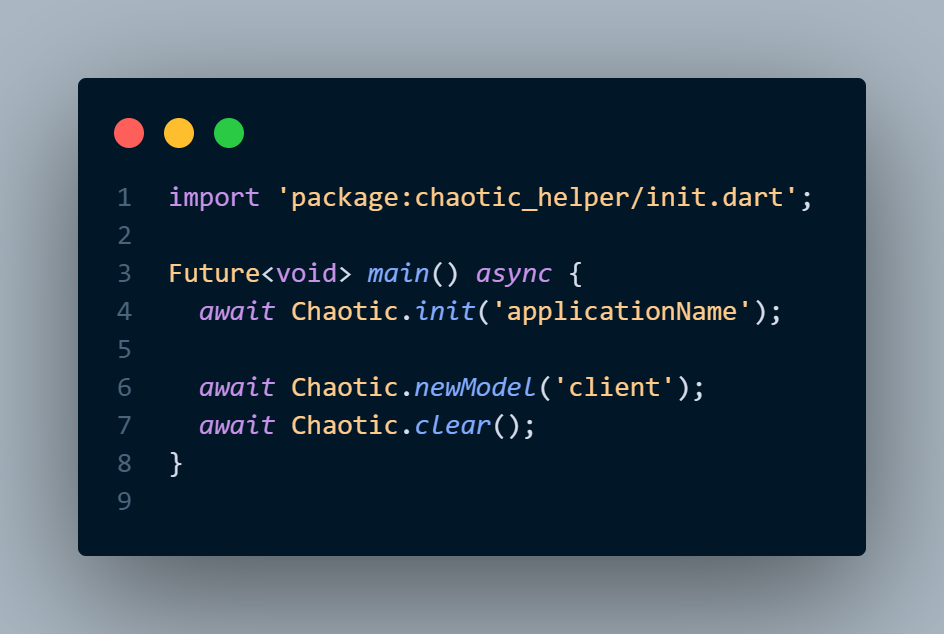
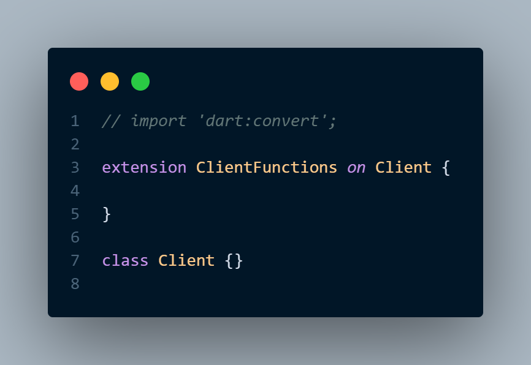

- model method must be separated from origin model class
- you can declare any number of method that you need in separated `extension` method

## Local Widget

1. if there is a widget that will used in one screen then create it as a local widget by passing `widget name` and `screen name` notes that screen name is a name of the folder that screen in.
2. 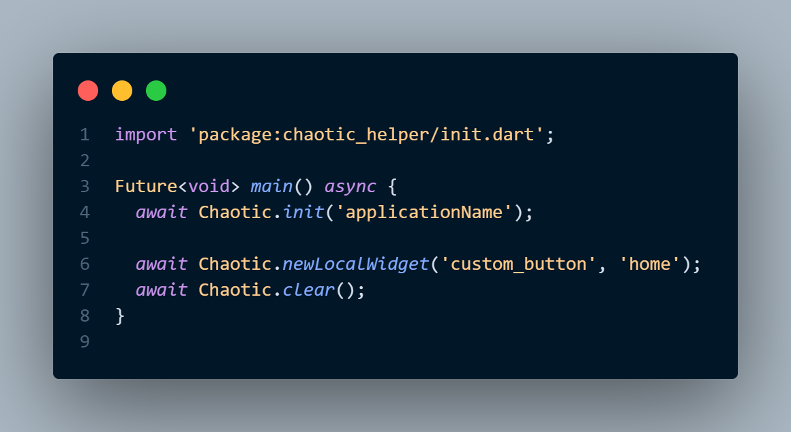

## Local Model

1. if there is a model that will used in one screen then create it as a local model by passing `model name` and `screen name` notes that screen name is a name of the folder that screen in.
2. 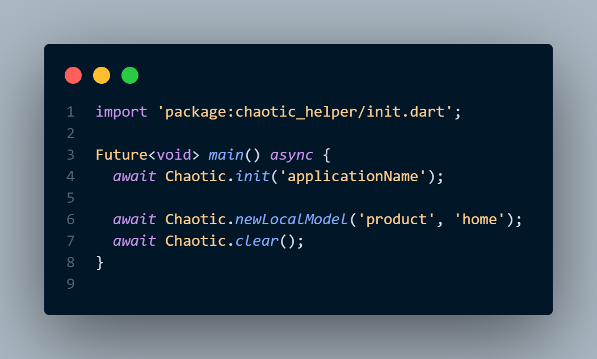

# Guides Packages

## Allowed Packages

Chaotic Package allow you to install some packages
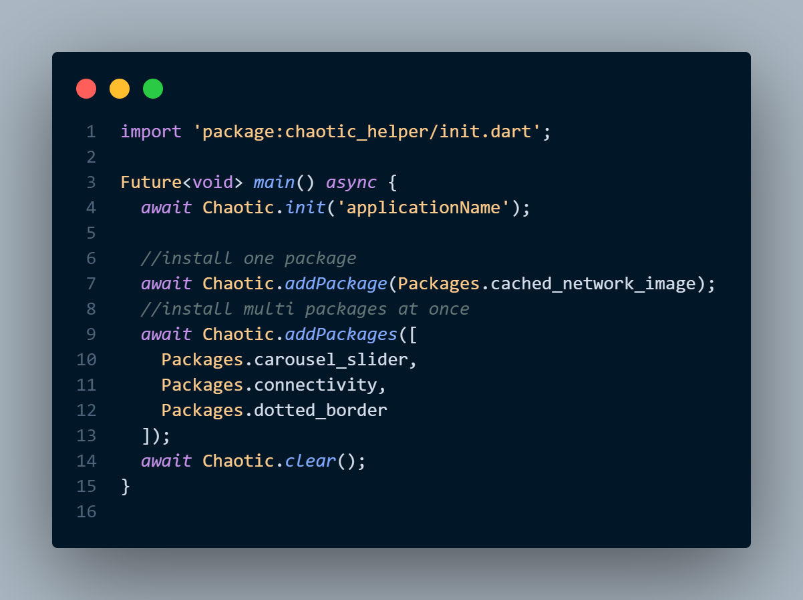

- **don't** add any package not in `Packages` list return to your team manager before adding any package not in allowed list

# Translation System

Chaotic already Created a Translation System in Project when you call `Chaotic.init()`
for more information how to use this system read about [EasyLocalization](https://pub.dev/packages/easy_localization)

# API Requests

all Api requests will handled by `DioService` class

1. how to initiate DioService this called `one time in main.dart file` 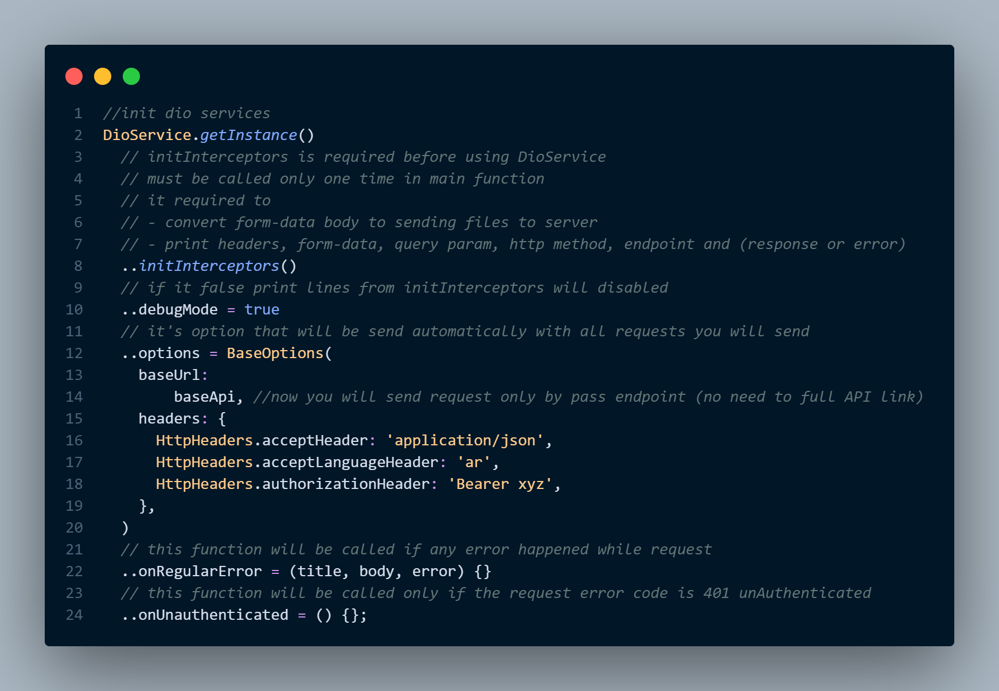
2. how to use it 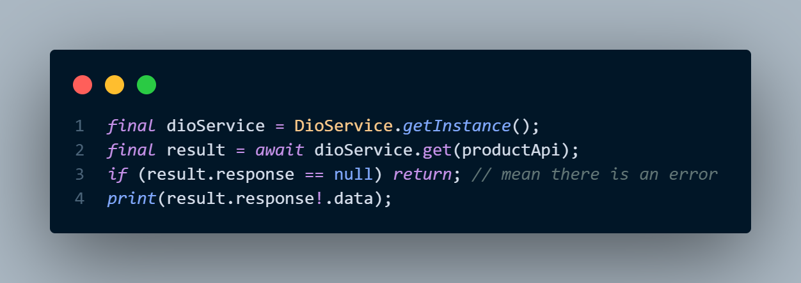

# Navigation Between Screens

Chaotic provider you with 4 different helper function to navigate between screens

1. `push(HomeScreen(), HomeProvider());` this line will open `HomeScreen` and pass `HomeProvider` to it, so home screen can use this provider.
2. `pushReplacement(HomeScreen(), HomeProvider());` this line will open `HomeScreen` and **close** current screen
3. `pushClear(HomeScreen(), HomeProvider());` this line will open `HomeScreen` and **close** all previous screens
4. `pop();` it will back to previous screen, you also can pass data using it `pop(data);`

# Code Guides

1. don't use `Text()` => use `CustomText()`
2. Use [Git Flow](https://www.youtube.com/watch?v=bhtE75RiN04&t=872s) not normal Git
3. make sure your file contain at least 10% comments about what's is going on and documentary comments
4. your design file have maximum number of lines 250 line, don't write more than 250 line in one design file, there is no limit in providers files
5. don't don't don't use function or methods to return a Widget, use a stateless widget
